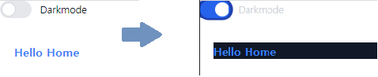

# 201840235 허성빈
    팀명 : 아몬드   
    이름 : 허성빈( 팀원 : 작품제작(프론트엔드 작업), 자료 취합, 타임키퍼(시간관리), 노션관리, 오픈웨더 전담 ), 최선아 ( 팀장 : 프론트엔드 작업, 회의주관, 일정조율, 활동독려, 회의록 정리, 사진촬영, 관광지 전담 등 ), 정서연 ( 팀원 : 작품제작, 자료 취합, 프레젠테이션 등 )   
    졸업작품 소개 사이트 : https://almond-daelim.github.io/NALJOMBWA/
    포트폴리오 소개 사이트 : URL (개인이 만든 GitHub 페이지) [ 안만들어도 상관없음 ]

## [ 졸업 작품 소개 ]   
 - 작품명 : 날좀봐
 - 개발환경 : 리엑트, HTML5, CSS, 테스트코드, eslint, prettier, Git, tailwind [ 추후 변경될 수 있음 ]
 - 작품 소개 : 현재 기상 상태를 사용자에게 전달해 주고 날씨가 좋은 지역의 관광장소와 명소를 사용자에게 추천해주는 사이트이다.
 - 작품의 특징 : 오픈웨더 api와 관광지 api를 사용하여 기상 정보를 가져온다.
 
 ## [ 개발 일지 ] ( 최소한 일주일에 한번 , 개인 수행평가 )
 ## (10월12일)
> 7주차 수업진행 내용 정리
 - openweathermap api를 이용하여 값 호출 작업 1차 완료
    - 
    - 앞으로 전국의 날씨 데이터(17지역)를 호출한 후 종합하여 맑은날씨의 데이터를 가진 지역의 데이터를 하나 랜덤으로 선택하여 화면에 뿌려주는 작업을 할 것
    - 영어로 나오는 지역 이름 및 날씨상태를 한글로 호출할 수 있도록 수정할 것
 - openweathermap api를 Github에 올리면서 발생한 오류를 수정할 것
    - 오류코드 : 'error: process completed with exit code 1.'
 - 저번주에 만든 ppt자료를 다시한번 확인하여 잘못된 부분이 있으면 수정할 것
 - openweathermap api중 지도 api를 호출하여 아래이미지 처럼 화면에 출력할 것
    - ex) 
- 지난주에 만든 openweather api 호출 값에 darkmode를 적용할 것
    - weather icon의 경우 api호출하는 과정에서 강제로 다크모드로 호출되는 경우가 있기에 이를 수정할 것
    - card의 color색상은 '1F2937으로 border색상은 none으로 처리
    - 폰트의 색상은 FFFFFF로 설정
 
 ## (10월05일)
 > 6주차 수업진행 내용 정리
 - openweathermap api를 이용하여 값 호출
    - 온도, 아이콘, 날씨 등을 호출하였음
    - 
 - 피그마 사이트에 올린 디자인 편집
    - 다크모드를 활성화 했을 때 나올 페이지를 아래의 이미지와 같이 제작 (추후 수정될 수 있음)
    - 
    - 사이트 홈페이지 로고를 올바르게 수정
        - 기존
        - 
        - 적용후
        - 
 - 다음주 까지 해야할 것
    - 이번주 일요일(10월09일)까지 졸업작품 ppt완성
        - 포스터에 들어갈 내용 지난주에 작성한 내용과 동일
    - openweathermap api에서 불러온 값을 이용하여 아래와 같이 만들기
        - 
    - openweathermap 의 'weather maps' api를 호출할 것
    - 피그마 사이트에 올린 모든 디자인 편집
        - 모든 페이지에 다크모드를 적용했을때의 디자인을 만들 것
        - header,footer,body의 다크모드 색상은 '1F2937'으로 설정하였음
        - header,footer,body의 구별은 stroke를 이용하여 구분 stroke의 색상은 '374151'으로 설정

 ### (09월28일)
 >5주차 수업진행 내용 정리
 - 지난번 담당 했던 기능 github에 올리기
 - Button 기능
    - Button, ArrowButton 기능 완성
    - 
    - 노션에 올려둔 팀 규칙에 작성방식을 참고하여 push함
    - github에 올리는 과정에서 아래와 같은 상황 발생
    -  발생
    - visual studio code에 <b>prettier</b>와 <b>eslint</b>를 설치하여 코드의 오류를 찾아 수정하여 정상화 하였음
 - DarkMode 기능
    - DarkMode 기능 github에 올리기
    - 노션에 올려둔 팀 규칙에 작성방식을 참고하여 push함
    -  또 다시 발생 
    - 위에서 나온것 처럼 코드를 수정하여 정상화 완료
 - openweathermap api
    - <b>axios</b>를 사용하여 api를 가져오는 기능까지 완료
    - 다음주 까지 온도,습도,날씨아이콘 등을 가져오는 기능 활성화 할것
 - 다음주까지 해야할 것
    - A1사이즈의 세로로 포스터 만들것 (<b>일러스트를 사용하여 만들어야한다</b>)
        - 포스터에 필수적으로 들어갈 요소 (CMYK)
            - 팀명(아몬드)
            - 팀장 (최선아), 팀원이름 (허성빈,정서연)
            - 대학명, 로고 (<b>대학 [홈페이지](https://www.daelim.ac.kr/cms/FrCon/index.do?MENU_ID=260)에 로고 일러 있음</b>)
            - 학과명 (컴퓨터정보학부) - outLine
        - 피그마에 올리 홈페이지 화면 디자인을 활용할 것
    - 졸업작품 PPT를 만들 것
        - 내용으로 팀원소개,작품소개,사용언어,구동방식,이벤트처리 방식등을 넣어 만들 것
        - 피그마에 올리 홈페이지 화면 디자인을 활용할 것
    

 ### (09월21일)
 >4주차 수업진행 내용 정리
 - 지난번 담당 했던 기능 완성
    - Footer(완성)
      위 이미지 같이 디자인 구현 ( 디자인은 추후 변경될 수 있음 )   
    - DarkMode(완성)  
       위 이미지 같은 기능과 스위치로 구현 ( 디자인은 추후 변경될 수 있음 ) 
        - darkmode button을 누르면 위의 이미지와 같이 css가 변경됨
        
    - Base Button, Arrow Button(미완성)
 - [tailwind css](https://tailwindcss.com/)의 사용법 숙지
 - 이번주 내 담당
    - openweathermap api : api구현 후 아래의 디자인과 같이 만들 것  
      
    - darkmode button ,footer : 지난주의 완성한 부분의 수정 및 보완작업
    - base button, left/right arrow button : 지난주의 작성한 대로 만들 것  
 - 이번주 목표
    - 지난번에 완성하지 못한 기능(button)을 구현
    - [openweathermap](https://openweathermap.org/api)의 api를 구현할 것
        - 팀 노션사이트의 규칙 및 참고사이트를 이용하여 만들것
        - 팀 피그마사이트를 참고하여 디자인 할 것

### (09월14일)
>3주차 수업진행 내용 정리
- 팀 로고 디자인 작업 시작
    - 완성된 로고디자인    
    
- 각 팀원별 역활 분담 ( 팀 github의 'components/common' 폴더란에 들어갈 기능을 구현하는것)
- 내 담당 
    - footer : 대림대학교 홈페이지 footer를 참고하여 만들 것  
    - base button : 'width : 285px / height : 101px' 로 만들 것   
      
    - left/right arrow button : 각각 'width: 30px / height : 45px' 로 만들 것  
      
    - darkmode button: 'width: 50px / height: 48px' 로 만들 것  
- 이번주 목표
    - 내가 담당하는 부분( footer, button, darkmode )을 디자인 부터 기능 까지 모두 구현할 것
        - 팀 노션사이트의 규칙 및 참고사이트를 이용하여 만들것

### (09월07일)
> 2주차 수업진행 내용 정리
- 팀 결성 ( 팀장 : 최선아, 팀원 : 허성빈, 주서연 )
- 팀 프로젝트 주제 정하기 ( 사용자의 날씨 정보 확인과 지역별 날씨에 따른 관광지 추천 사이트 )
- 팀 프로젝트에 사용될 api 검색 ( [openweatherAPi](https://openweathermap.org/api)를 사용할 것)
- 팀원 역활 분담 및 팀 규칙 정하기
    - 나의 경우 작품제작, 참여인원 체크, 자료 취합, 타입키퍼, 노션관리의 역활을 수행할 것

### (08월31일)   
> 1주차 수업진행 내용 정리
- [공유리스트](https://bit.ly/3AupOKk)에 자신의 github repo주소 , 역활 등 올리기 및 조편성 
- 졸업 작품에 관한 생각 설문조사 [실시](https://docs.google.com/forms/d/e/1FAIpQLSfGDeNXpHiORS5-yfNuk5ZC9uGqSlD8vCRrlB9KgsstDqCtag/viewform)  
- README.md 작성시 [Markdown](https://gist.github.com/ihoneymon/652be052a0727ad59601) 을 활용하여 작성
- README.md 작성 요령 및 GitHub Commit 방법 [설명](https://sudo-minz.tistory.com/10)
